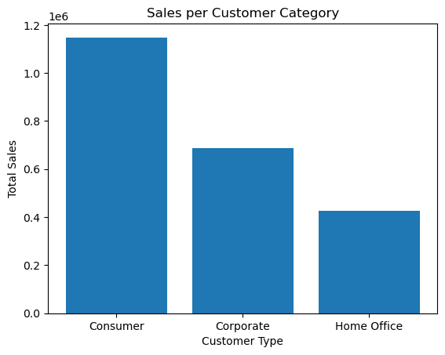
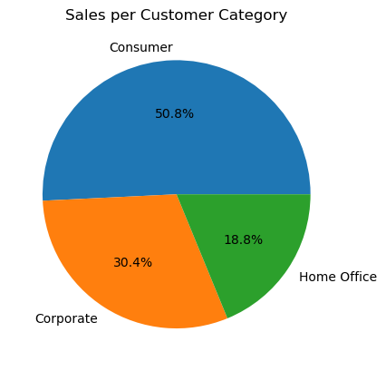
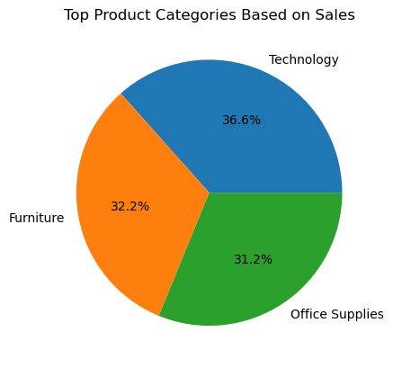
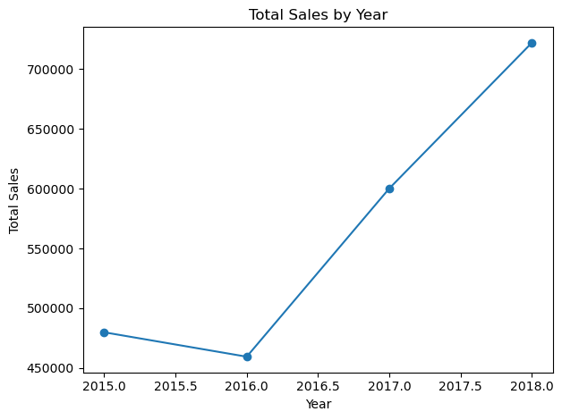
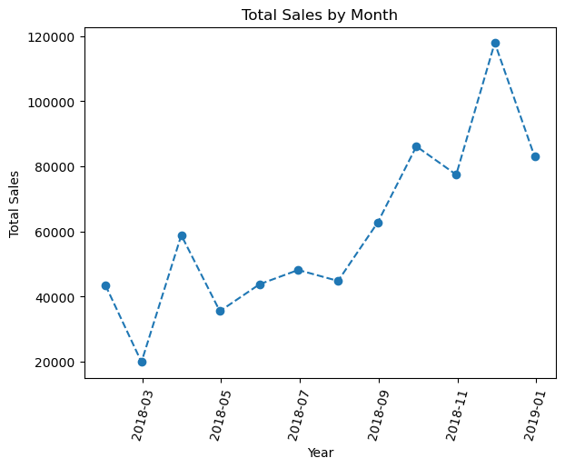
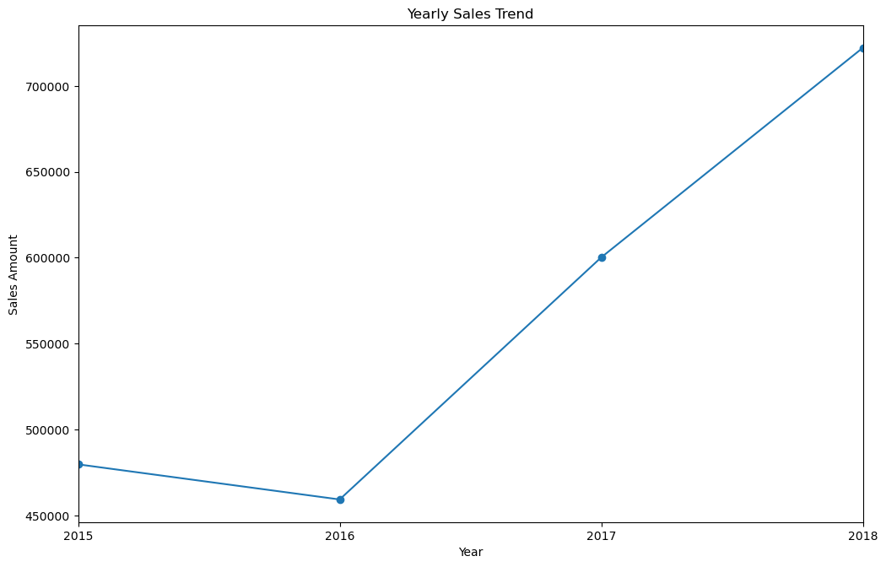

```python
# importation of python libraries

import pandas as pd
import numpy as np 
import matplotlib.pyplot as plt 


```


```python
df = pd.read_csv(r"C:\Users\abhis\OneDrive\Desktop\sales analysis project\sales data.csv")

df.head()
```


<div>
<style scoped>
    .dataframe tbody tr th:only-of-type {
        vertical-align: middle;
    }

    .dataframe tbody tr th {
        vertical-align: top;
    }

    .dataframe thead th {
        text-align: right;
    }
</style>
<table border="1" class="dataframe">
  <thead>
    <tr style="text-align: right;">
      <th></th>
      <th>Row ID</th>
      <th>Order ID</th>
      <th>Order Date</th>
      <th>Ship Date</th>
      <th>Ship Mode</th>
      <th>Customer ID</th>
      <th>Customer Name</th>
      <th>Segment</th>
      <th>Country</th>
      <th>City</th>
      <th>State</th>
      <th>Postal Code</th>
      <th>Region</th>
      <th>Product ID</th>
      <th>Category</th>
      <th>Sub-Category</th>
      <th>Product Name</th>
      <th>Sales</th>
    </tr>
  </thead>
  <tbody>
    <tr>
      <th>0</th>
      <td>1</td>
      <td>CA-2017-152156</td>
      <td>8/11/2017</td>
      <td>11/11/2017</td>
      <td>Second Class</td>
      <td>CG-12520</td>
      <td>Claire Gute</td>
      <td>Consumer</td>
      <td>United States</td>
      <td>Henderson</td>
      <td>Kentucky</td>
      <td>42420.0</td>
      <td>South</td>
      <td>FUR-BO-10001798</td>
      <td>Furniture</td>
      <td>Bookcases</td>
      <td>Bush Somerset Collection Bookcase</td>
      <td>261.9600</td>
    </tr>
    <tr>
      <th>1</th>
      <td>2</td>
      <td>CA-2017-152156</td>
      <td>8/11/2017</td>
      <td>11/11/2017</td>
      <td>Second Class</td>
      <td>CG-12520</td>
      <td>Claire Gute</td>
      <td>Consumer</td>
      <td>United States</td>
      <td>Henderson</td>
      <td>Kentucky</td>
      <td>42420.0</td>
      <td>South</td>
      <td>FUR-CH-10000454</td>
      <td>Furniture</td>
      <td>Chairs</td>
      <td>Hon Deluxe Fabric Upholstered Stacking Chairs,...</td>
      <td>731.9400</td>
    </tr>
    <tr>
      <th>2</th>
      <td>3</td>
      <td>CA-2017-138688</td>
      <td>12/6/2017</td>
      <td>16/06/2017</td>
      <td>Second Class</td>
      <td>DV-13045</td>
      <td>Darrin Van Huff</td>
      <td>Corporate</td>
      <td>United States</td>
      <td>Los Angeles</td>
      <td>California</td>
      <td>90036.0</td>
      <td>West</td>
      <td>OFF-LA-10000240</td>
      <td>Office Supplies</td>
      <td>Labels</td>
      <td>Self-Adhesive Address Labels for Typewriters b...</td>
      <td>14.6200</td>
    </tr>
    <tr>
      <th>3</th>
      <td>4</td>
      <td>US-2016-108966</td>
      <td>11/10/2016</td>
      <td>18/10/2016</td>
      <td>Standard Class</td>
      <td>SO-20335</td>
      <td>Sean O'Donnell</td>
      <td>Consumer</td>
      <td>United States</td>
      <td>Fort Lauderdale</td>
      <td>Florida</td>
      <td>33311.0</td>
      <td>South</td>
      <td>FUR-TA-10000577</td>
      <td>Furniture</td>
      <td>Tables</td>
      <td>Bretford CR4500 Series Slim Rectangular Table</td>
      <td>957.5775</td>
    </tr>
    <tr>
      <th>4</th>
      <td>5</td>
      <td>US-2016-108966</td>
      <td>11/10/2016</td>
      <td>18/10/2016</td>
      <td>Standard Class</td>
      <td>SO-20335</td>
      <td>Sean O'Donnell</td>
      <td>Consumer</td>
      <td>United States</td>
      <td>Fort Lauderdale</td>
      <td>Florida</td>
      <td>33311.0</td>
      <td>South</td>
      <td>OFF-ST-10000760</td>
      <td>Office Supplies</td>
      <td>Storage</td>
      <td>Eldon Fold 'N Roll Cart System</td>
      <td>22.3680</td>
    </tr>
  </tbody>
</table>
</div>


Number of null values in column postal code


```python

null_count = df['Postal Code'].isnull().sum()
print(null_count)
```

    11
    

filling null values  


```python

df["Postal Code"].fillna(0, inplace = True) 

df['Postal Code'] = df['Postal Code'].astype(int)

df.info()
```

    <class 'pandas.core.frame.DataFrame'>
    RangeIndex: 9800 entries, 0 to 9799
    Data columns (total 18 columns):
     #   Column         Non-Null Count  Dtype  
    ---  ------         --------------  -----  
     0   Row ID         9800 non-null   int64  
     1   Order ID       9800 non-null   object 
     2   Order Date     9800 non-null   object 
     3   Ship Date      9800 non-null   object 
     4   Ship Mode      9800 non-null   object 
     5   Customer ID    9800 non-null   object 
     6   Customer Name  9800 non-null   object 
     7   Segment        9800 non-null   object 
     8   Country        9800 non-null   object 
     9   City           9800 non-null   object 
     10  State          9800 non-null   object 
     11  Postal Code    9800 non-null   int32  
     12  Region         9800 non-null   object 
     13  Product ID     9800 non-null   object 
     14  Category       9800 non-null   object 
     15  Sub-Category   9800 non-null   object 
     16  Product Name   9800 non-null   object 
     17  Sales          9800 non-null   float64
    dtypes: float64(1), int32(1), int64(1), object(15)
    memory usage: 1.3+ MB
    


```python
df.describe()
```


<div>
<style scoped>
    .dataframe tbody tr th:only-of-type {
        vertical-align: middle;
    }

    .dataframe tbody tr th {
        vertical-align: top;
    }

    .dataframe thead th {
        text-align: right;
    }
</style>
<table border="1" class="dataframe">
  <thead>
    <tr style="text-align: right;">
      <th></th>
      <th>Row ID</th>
      <th>Postal Code</th>
      <th>Sales</th>
    </tr>
  </thead>
  <tbody>
    <tr>
      <th>count</th>
      <td>9800.000000</td>
      <td>9800.000000</td>
      <td>9800.000000</td>
    </tr>
    <tr>
      <th>mean</th>
      <td>4900.500000</td>
      <td>55211.280918</td>
      <td>230.769059</td>
    </tr>
    <tr>
      <th>std</th>
      <td>2829.160653</td>
      <td>32076.677954</td>
      <td>626.651875</td>
    </tr>
    <tr>
      <th>min</th>
      <td>1.000000</td>
      <td>0.000000</td>
      <td>0.444000</td>
    </tr>
    <tr>
      <th>25%</th>
      <td>2450.750000</td>
      <td>23223.000000</td>
      <td>17.248000</td>
    </tr>
    <tr>
      <th>50%</th>
      <td>4900.500000</td>
      <td>57551.000000</td>
      <td>54.490000</td>
    </tr>
    <tr>
      <th>75%</th>
      <td>7350.250000</td>
      <td>90008.000000</td>
      <td>210.605000</td>
    </tr>
    <tr>
      <th>max</th>
      <td>9800.000000</td>
      <td>99301.000000</td>
      <td>22638.480000</td>
    </tr>
  </tbody>
</table>
</div>


### Checking for duplicates 


```python
if df.duplicated().sum() > 0:  # 
    print("Duplicates exist in the DataFrame.")
else:
    print("No duplicates found in the DataFrame.")
```

    No duplicates found in the DataFrame.
    

Types of customers


```python


types_of_customers = df['Segment'].unique()
print(types_of_customers)
```

    ['Consumer' 'Corporate' 'Home Office']
    

Number of customers in each segment 


```python


customer_segmentation = df['Segment'].value_counts().reset_index() 
customer_segmentation = customer_segmentation.rename(columns={'index': 'Customer Type', 'Segment': 'Total Customers'})


print(customer_segmentation)
```

      Customer Type  Total Customers
    0      Consumer             5101
    1     Corporate             2953
    2   Home Office             1746
    

Customers and Sales 


```python


sales_per_segment = df.groupby('Segment')['Sales'].sum().reset_index()
sales_per_segment = sales_per_segment.rename(columns={'Segment': 'Customer Type', 'Sales': 'Total Sales'})

print(sales_per_segment)
```

      Customer Type   Total Sales
    0      Consumer  1.148061e+06
    1     Corporate  6.884941e+05
    2   Home Office  4.249822e+05
    

Bar graph


```python


plt.bar(sales_per_segment['Customer Type'], sales_per_segment['Total Sales'])

plt.title('Sales per Customer Category')
plt.xlabel('Customer Type')
plt.ylabel('Total Sales')

plt.show()

```


    

    


```python
plt.pie(sales_per_segment['Total Sales'], labels=sales_per_segment['Customer Type'], autopct='%1.1f%%')
plt.title('Sales per Customer Category')
plt.show()
```


    

    


Repeat purchase items of customers


```python
df.head(2)
```


<div>
<style scoped>
    .dataframe tbody tr th:only-of-type {
        vertical-align: middle;
    }

    .dataframe tbody tr th {
        vertical-align: top;
    }

    .dataframe thead th {
        text-align: right;
    }
</style>
<table border="1" class="dataframe">
  <thead>
    <tr style="text-align: right;">
      <th></th>
      <th>Row ID</th>
      <th>Order ID</th>
      <th>Order Date</th>
      <th>Ship Date</th>
      <th>Ship Mode</th>
      <th>Customer ID</th>
      <th>Customer Name</th>
      <th>Segment</th>
      <th>Country</th>
      <th>City</th>
      <th>State</th>
      <th>Postal Code</th>
      <th>Region</th>
      <th>Product ID</th>
      <th>Category</th>
      <th>Sub-Category</th>
      <th>Product Name</th>
      <th>Sales</th>
    </tr>
  </thead>
  <tbody>
    <tr>
      <th>0</th>
      <td>1</td>
      <td>CA-2017-152156</td>
      <td>8/11/2017</td>
      <td>11/11/2017</td>
      <td>Second Class</td>
      <td>CG-12520</td>
      <td>Claire Gute</td>
      <td>Consumer</td>
      <td>United States</td>
      <td>Henderson</td>
      <td>Kentucky</td>
      <td>42420</td>
      <td>South</td>
      <td>FUR-BO-10001798</td>
      <td>Furniture</td>
      <td>Bookcases</td>
      <td>Bush Somerset Collection Bookcase</td>
      <td>261.96</td>
    </tr>
    <tr>
      <th>1</th>
      <td>2</td>
      <td>CA-2017-152156</td>
      <td>8/11/2017</td>
      <td>11/11/2017</td>
      <td>Second Class</td>
      <td>CG-12520</td>
      <td>Claire Gute</td>
      <td>Consumer</td>
      <td>United States</td>
      <td>Henderson</td>
      <td>Kentucky</td>
      <td>42420</td>
      <td>South</td>
      <td>FUR-CH-10000454</td>
      <td>Furniture</td>
      <td>Chairs</td>
      <td>Hon Deluxe Fabric Upholstered Stacking Chairs,...</td>
      <td>731.94</td>
    </tr>
  </tbody>
</table>
</div>


Highest spending customers


```python

customer_sales = df.groupby(['Customer ID', 'Customer Name', 'Segment'])['Sales'].sum().reset_index()


top_spenders = customer_sales.sort_values(by='Sales', ascending=False)

print(top_spenders.head(10).reset_index(drop=True))
```

      Customer ID       Customer Name      Segment      Sales
    0    SM-20320         Sean Miller  Home Office  25043.050
    1    TC-20980        Tamara Chand    Corporate  19052.218
    2    RB-19360        Raymond Buch     Consumer  15117.339
    3    TA-21385        Tom Ashbrook  Home Office  14595.620
    4    AB-10105       Adrian Barton     Consumer  14473.571
    5    KL-16645        Ken Lonsdale     Consumer  14175.229
    6    SC-20095        Sanjit Chand     Consumer  14142.334
    7    HL-15040        Hunter Lopez     Consumer  12873.298
    8    SE-20110        Sanjit Engle     Consumer  12209.438
    9    CC-12370  Christopher Conant     Consumer  12129.072
    

Shipping methods


```python


types_of_customers = df['Ship Mode'].unique()
print(types_of_customers)
```

    ['Second Class' 'Standard Class' 'First Class' 'Same Day']
    


```python
df.head(2)
```


<div>
<style scoped>
    .dataframe tbody tr th:only-of-type {
        vertical-align: middle;
    }

    .dataframe tbody tr th {
        vertical-align: top;
    }

    .dataframe thead th {
        text-align: right;
    }
</style>
<table border="1" class="dataframe">
  <thead>
    <tr style="text-align: right;">
      <th></th>
      <th>Row ID</th>
      <th>Order ID</th>
      <th>Order Date</th>
      <th>Ship Date</th>
      <th>Ship Mode</th>
      <th>Customer ID</th>
      <th>Customer Name</th>
      <th>Segment</th>
      <th>Country</th>
      <th>City</th>
      <th>State</th>
      <th>Postal Code</th>
      <th>Region</th>
      <th>Product ID</th>
      <th>Category</th>
      <th>Sub-Category</th>
      <th>Product Name</th>
      <th>Sales</th>
    </tr>
  </thead>
  <tbody>
    <tr>
      <th>0</th>
      <td>1</td>
      <td>CA-2017-152156</td>
      <td>8/11/2017</td>
      <td>11/11/2017</td>
      <td>Second Class</td>
      <td>CG-12520</td>
      <td>Claire Gute</td>
      <td>Consumer</td>
      <td>United States</td>
      <td>Henderson</td>
      <td>Kentucky</td>
      <td>42420</td>
      <td>South</td>
      <td>FUR-BO-10001798</td>
      <td>Furniture</td>
      <td>Bookcases</td>
      <td>Bush Somerset Collection Bookcase</td>
      <td>261.96</td>
    </tr>
    <tr>
      <th>1</th>
      <td>2</td>
      <td>CA-2017-152156</td>
      <td>8/11/2017</td>
      <td>11/11/2017</td>
      <td>Second Class</td>
      <td>CG-12520</td>
      <td>Claire Gute</td>
      <td>Consumer</td>
      <td>United States</td>
      <td>Henderson</td>
      <td>Kentucky</td>
      <td>42420</td>
      <td>South</td>
      <td>FUR-CH-10000454</td>
      <td>Furniture</td>
      <td>Chairs</td>
      <td>Hon Deluxe Fabric Upholstered Stacking Chairs,...</td>
      <td>731.94</td>
    </tr>
  </tbody>
</table>
</div>


```python


shipping_model = df['Ship Mode'].value_counts().reset_index()
shipping_model = shipping_model.rename(columns={'index':'Mode_of_Shipment', 'Ship Mode': 'Use Frequency'})

print(shipping_model)

```

      Mode_of_Shipment  Use Frequency
    0   Standard Class           5859
    1     Second Class           1902
    2      First Class           1501
    3         Same Day            538
    

Customers in every state 


```python


state = df['State'].value_counts().reset_index()
state = state.rename(columns={'index':'State', 'State':'Number_of_customers'})

print(state.head(20))
```

                 State  Number_of_customers
    0       California                 1946
    1         New York                 1097
    2            Texas                  973
    3     Pennsylvania                  582
    4       Washington                  504
    5         Illinois                  483
    6             Ohio                  454
    7          Florida                  373
    8         Michigan                  253
    9   North Carolina                  247
    10        Virginia                  224
    11         Arizona                  223
    12       Tennessee                  183
    13        Colorado                  179
    14         Georgia                  177
    15        Kentucky                  137
    16         Indiana                  135
    17   Massachusetts                  135
    18          Oregon                  122
    19      New Jersey                  122
    

Customers in every city 


```python
 

city = df['City'].value_counts().reset_index()
city= city.rename(columns={'index':'City', 'City':'Number_of_customers'})

print(city.head(15))
```

                 City  Number_of_customers
    0   New York City                  891
    1     Los Angeles                  728
    2    Philadelphia                  532
    3   San Francisco                  500
    4         Seattle                  426
    5         Houston                  374
    6         Chicago                  308
    7        Columbus                  221
    8       San Diego                  170
    9     Springfield                  161
    10         Dallas                  156
    11   Jacksonville                  125
    12        Detroit                  115
    13         Newark                   92
    14        Jackson                   82
    

Sales in every state 


```python


state_sales = df.groupby(['State'])['Sales'].sum().reset_index()


top_sales = state_sales.sort_values(by='Sales', ascending=False)
 
print(top_sales.head(20).reset_index(drop=True))
```

                 State        Sales
    0       California  446306.4635
    1         New York  306361.1470
    2            Texas  168572.5322
    3       Washington  135206.8500
    4     Pennsylvania  116276.6500
    5          Florida   88436.5320
    6         Illinois   79236.5170
    7         Michigan   76136.0740
    8             Ohio   75130.3500
    9         Virginia   70636.7200
    10  North Carolina   55165.9640
    11         Indiana   48718.4000
    12         Georgia   48219.1100
    13        Kentucky   36458.3900
    14         Arizona   35272.6570
    15      New Jersey   34610.9720
    16        Colorado   31841.5980
    17       Wisconsin   31173.4300
    18       Tennessee   30661.8730
    19       Minnesota   29863.1500
    


```python
state_city_sales = df.groupby(['State','City'])['Sales'].sum().reset_index()

print(state_city_sales.head(20))
```

          State           City      Sales
    0   Alabama         Auburn   1766.830
    1   Alabama        Decatur   3374.820
    2   Alabama       Florence   1997.350
    3   Alabama         Hoover    525.850
    4   Alabama     Huntsville   2484.370
    5   Alabama         Mobile   5462.990
    6   Alabama     Montgomery   3722.730
    7   Alabama     Tuscaloosa    175.700
    8   Arizona       Avondale    946.808
    9   Arizona  Bullhead City     22.288
    10  Arizona       Chandler   1067.403
    11  Arizona        Gilbert   4172.382
    12  Arizona       Glendale   2917.865
    13  Arizona           Mesa   4037.740
    14  Arizona         Peoria   1341.352
    15  Arizona        Phoenix  11000.257
    16  Arizona     Scottsdale   1466.307
    17  Arizona   Sierra Vista     76.072
    18  Arizona          Tempe   1070.302
    19  Arizona         Tucson   6313.016
    

Types of products


```python

products = df['Category'].unique()
print(products)
```

    ['Furniture' 'Office Supplies' 'Technology']
    


```python
product_subcategory = df['Sub-Category'].unique()
print(product_subcategory)
```

    ['Bookcases' 'Chairs' 'Labels' 'Tables' 'Storage' 'Furnishings' 'Art'
     'Phones' 'Binders' 'Appliances' 'Paper' 'Accessories' 'Envelopes'
     'Fasteners' 'Supplies' 'Machines' 'Copiers']
    


```python
subcategory_count_sales = df.groupby(['Category','Sub-Category'])['Sales'].sum().reset_index()

print(subcategory_count_sales)
```

               Category Sub-Category        Sales
    0         Furniture    Bookcases  113813.1987
    1         Furniture       Chairs  322822.7310
    2         Furniture  Furnishings   89212.0180
    3         Furniture       Tables  202810.6280
    4   Office Supplies   Appliances  104618.4030
    5   Office Supplies          Art   26705.4100
    6   Office Supplies      Binders  200028.7850
    7   Office Supplies    Envelopes   16128.0460
    8   Office Supplies    Fasteners    3001.9600
    9   Office Supplies       Labels   12347.7260
    10  Office Supplies        Paper   76828.3040
    11  Office Supplies      Storage  219343.3920
    12  Office Supplies     Supplies   46420.3080
    13       Technology  Accessories  164186.7000
    14       Technology      Copiers  146248.0940
    15       Technology     Machines  189238.6310
    16       Technology       Phones  327782.4480
    


```python
 
plt.pie(top_product_category['Sales'], labels=top_product_category['Category'], autopct='%1.1f%%')

plt.title('Top Product Categories Based on Sales')
        
plt.show()

```


    

    


```python

product_subcategory = df.groupby(['Sub-Category'])['Sales'].sum().reset_index()


top_product_subcategory = product_subcategory.sort_values(by='Sales', ascending=False) 

print(top_product_subcategory.reset_index(drop=True))
```

       Sub-Category        Sales
    0        Phones  327782.4480
    1        Chairs  322822.7310
    2       Storage  219343.3920
    3        Tables  202810.6280
    4       Binders  200028.7850
    5      Machines  189238.6310
    6   Accessories  164186.7000
    7       Copiers  146248.0940
    8     Bookcases  113813.1987
    9    Appliances  104618.4030
    10  Furnishings   89212.0180
    11        Paper   76828.3040
    12     Supplies   46420.3080
    13          Art   26705.4100
    14    Envelopes   16128.0460
    15       Labels   12347.7260
    16    Fasteners    3001.9600
    

## Sales 


```python


df['Order Date'] = pd.to_datetime(df['Order Date'], dayfirst=True)


yearly_sales = df.groupby(df['Order Date'].dt.year)['Sales'].sum()

yearly_sales = yearly_sales.reset_index()
yearly_sales = yearly_sales.rename(columns={'Order Date': 'Year', 'Sales':'Total Sales'})

print(yearly_sales)
```

       Year  Total Sales
    0  2015  479856.2081
    1  2016  459436.0054
    2  2017  600192.5500
    3  2018  722052.0192
    

Total sales by Year


```python

plt.plot(yearly_sales['Year'], yearly_sales['Total Sales'], marker='o', linestyle='-')
plt.xlabel('Year')
plt.ylabel('Total Sales')
plt.title('Total Sales by Year')

plt.tight_layout()

plt.show()
```


    

    


```python

df['Order Date'] = pd.to_datetime(df['Order Date'], dayfirst=True)


year_sales = df[df['Order Date'].dt.year == 2018]


monthly_sales = year_sales.resample('M', on='Order Date')['Sales'].sum()


monthly_sales = monthly_sales.reset_index()
monthly_sales = monthly_sales.rename(columns={'Order Date':'Month', 'Sales':'Total Montly Sales'})


print("Monthly Sales for 2018:")
print(monthly_sales)

```

    Monthly Sales for 2018:
            Month  Total Montly Sales
    0  2018-01-31          43476.4740
    1  2018-02-28          19920.9974
    2  2018-03-31          58863.4128
    3  2018-04-30          35541.9101
    4  2018-05-31          43825.9822
    5  2018-06-30          48190.7277
    6  2018-07-31          44825.1040
    7  2018-08-31          62837.8480
    8  2018-09-30          86152.8880
    9  2018-10-31          77448.1312
    10 2018-11-30         117938.1550
    11 2018-12-31          83030.3888
    

Total sales by Month


```python

plt.plot(monthly_sales['Month'], monthly_sales['Total Montly Sales'], marker='o', linestyle='--')

plt.xlabel('Year')
plt.ylabel('Total Sales')
plt.title('Total Sales by Month')

plt.tight_layout()
plt.xticks(rotation=75)

plt.show()
```


    

    


Yearly sales 


```python

df['Order Date'] = pd.to_datetime(df['Order Date'], dayfirst=True)


yearly_sales = df.groupby(df['Order Date'].dt.to_period('Y'))['Sales'].sum()


plt.figure(figsize=(12, 26))


plt.subplot(3, 1, 3)
yearly_sales.plot(kind='line', marker='o')
plt.title('Yearly Sales Trend')
plt.xlabel('Year')
plt.ylabel('Sales Amount')


plt.show()
```


    

    

